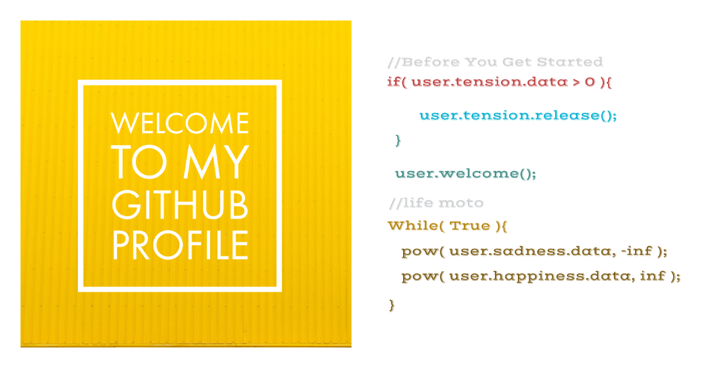

### Hi there 👋

<h2>About Me</h2>
<h4>
    <ul>
     <li>💻 I’m currently working on Web Development, .</li>
     <li>I’m currently learning Java</li>
    <li>📫 How to reach me: Links are given below</li>
    <li>⚡ Languages: Python, C, Java, HTML5, CSS, jinja2, SCSS.</li>
    </ul>
</h4>

  <a href="https://github.com/uditkumar01"><h2>Udit Kumar </h2></a>
  
&nbsp;&nbsp;  &nbsp;&nbsp;  &nbsp;&nbsp;  &nbsp;&nbsp;  

  

